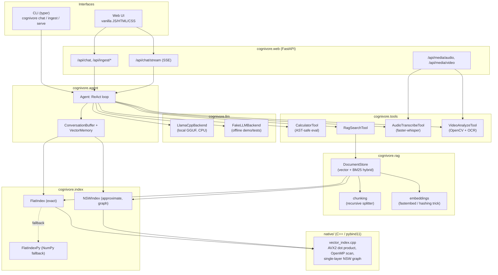

# Architecture

## Component overview

## Why a ReAct loop instead of native function calling

Every mainstream LLM provider now ships a "function calling" / "tool use"
API, but those are provider-specific wire formats layered on top of a model
that was fine-tuned to emit them. A small local GGUF model may or may not
have been tuned for any particular one of those formats. The
Thought/Action/Action Input/Observation protocol from ReAct (Yao et al.,
2022) is just structured *text*, so it works with any instruction-tuned
model regardless of what tool-call syntax (if any) it was fine-tuned on --
which matters when "any open model the user has downloaded" is the actual
target, not "whichever model happens to support our preferred wire
format." See `cognivore/agent/prompts.py` and `cognivore/agent/parsing.py`.

## Why a hand-written C++ index instead of Faiss/hnswlib

Two reasons, both deliberate:

1. **It's the point of the exercise.** Wiring up an existing ANN library
   would ship a working RAG pipeline; writing the AVX2 dot-product kernel,
   the OpenMP-parallel brute-force scan, and a single-layer NSW graph
   (insertion, pruning, greedy beam search) from scratch demonstrates the
   underlying systems knowledge instead of hiding it behind a dependency.
2. **The graceful-degradation story is real.** Because the whole thing is
   ~400 lines of self-contained C++ with a documented pure-Python fallback,
   `pip install` never *fails* for lack of a compiler -- it just quietly
   gets slower. A dependency on a large prebuilt binary library wouldn't
   offer that same guarantee across every platform pip needs to support.

The trade-off is honestly documented in [README.md](../README.md)'s
benchmark section: a hand-written single-layer NSW is not competitive with
Faiss/hnswlib's heavily-tuned multi-layer HNSW, and at small-to-medium
collection sizes on a low core count, a SIMD+OpenMP brute-force scan can
still beat it outright. The roadmap below tracks closing that gap.

## Roadmap

- [ ] Multi-layer HNSW (the current `NSWIndex` is single-layer NSW, which
      the docstring in `native/vector_index.hpp` is explicit about).
- [ ] Real speaker diarization (pyannote) behind the same
      `diarize_by_energy` interface, as a heavier optional extra.
- [ ] A lightweight CPU-friendly captioning model as an alternative to the
      keyframe+OCR heuristic in `cognivore.media.video`.
- [ ] Persist `VectorMemory` across process restarts (currently in-memory
      only within a single `cognivore chat` / `serve` session).
- [ ] `cibuildwheel`-based prebuilt wheels so `pip install cognivore` works
      without a C++ toolchain on the most common platforms.
