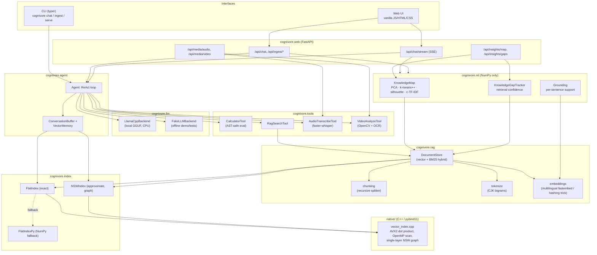

# Architecture

## Component overview

```mermaid
flowchart TB
    subgraph UI["Interfaces"]
        CLI["CLI (typer)\ncognivore chat / ingest / serve"]
        WEB["Web UI\nvanilla JS/HTML/CSS"]
    end

    subgraph API["cognivore.web (FastAPI)"]
        REST["/api/chat, /api/ingest/*"]
        SSE["/api/chat/stream (SSE)"]
        MEDIA["/api/media/audio, /api/media/video"]
        INSIGHTS["/api/insights/map, /api/insights/gaps"]
    end

    subgraph ML["cognivore.ml (NumPy only)"]
        KMAP["KnowledgeMap\nPCA · k-means++ · silhouette · c-TF-IDF"]
        GROUND["Grounding\nper-sentence support"]
        GAPS["KnowledgeGapTracker\nretrieval confidence"]
    end

    subgraph AGENT["cognivore.agent"]
        LOOP["Agent: ReAct loop"]
        MEM["ConversationBuffer +\nVectorMemory"]
    end

    subgraph LLM["cognivore.llm"]
        LLAMA["LlamaCppBackend\n(local GGUF, CPU)"]
        FAKE["FakeLLMBackend\n(offline demo/tests)"]
    end

    subgraph TOOLS["cognivore.tools"]
        CALC["CalculatorTool\n(AST-safe eval)"]
        RAGT["RagSearchTool"]
        AUDIO["AudioTranscribeTool\n(faster-whisper)"]
        VIDEO["VideoAnalyzeTool\n(OpenCV + OCR)"]
    end

    subgraph RAG["cognivore.rag"]
        CHUNK["chunking\n(recursive splitter)"]
        TOK["tokenize\n(CJK bigrams)"]
        EMB["embeddings\n(multilingual fastembed / hashing trick)"]
        STORE["DocumentStore\n(vector + BM25 hybrid)"]
    end

    subgraph INDEX["cognivore.index"]
        FLAT["FlatIndex (exact)"]
        NSW["NSWIndex (approximate, graph)"]
        PYFALLBACK["FlatIndexPy (NumPy fallback)"]
    end

    subgraph NATIVE["native/ (C++ / pybind11)"]
        CPP["vector_index.cpp\nAVX2 dot product, OpenMP scan,\nsingle-layer NSW graph"]
    end

    CLI --> LOOP
    WEB --> REST
    WEB --> SSE
    REST --> LOOP
    SSE --> LOOP
    MEDIA --> AUDIO
    MEDIA --> VIDEO

    LOOP --> LLAMA
    LOOP --> FAKE
    LOOP --> CALC
    LOOP --> RAGT
    LOOP --> AUDIO
    LOOP --> VIDEO
    LOOP --> MEM

    RAGT --> STORE
    STORE --> CHUNK
    STORE --> TOK
    STORE --> EMB
    SSE --> ML
    REST --> ML
    INSIGHTS --> KMAP
    INSIGHTS --> GAPS
    KMAP --> STORE
    GROUND --> EMB
    GAPS --> STORE
    STORE --> FLAT
    STORE --> NSW
    MEM --> FLAT
    MEM --> NSW

    FLAT --> CPP
    NSW --> CPP
    FLAT -.fallback.-> PYFALLBACK
```

## The explainability layer (`cognivore.ml`)

After every turn the web layer builds a `TurnInsight`
(`cognivore/ml/insight.py`) and streams it as a final `insight` SSE event,
*after* the answer itself has finished streaming, so it never delays the
answer. Any failure there is logged and the turn simply ships without an
insight.

- **Knowledge map** (`knowledge_map.py`): the store keeps every chunk's
  embedding (persisted as `vectors.npy` next to the index). The map
  L2-normalizes them, projects to 2-D with PCA (`projection.py`, covariance
  eigendecomposition with deterministic component signs), clusters with
  k-means++ for every k in 2..8 and keeps the k with the best silhouette
  score (`clustering.py`), and names each cluster by class-based TF-IDF
  (`topics.py`). It is cached per `DocumentStore.version`, so it is only
  recomputed after an ingest; stores larger than `map_max_points` are
  mapped from a deterministic sample.
- **Grounding** (`grounding.py`): the answer is split into sentences with
  character offsets; each sentence is scored against each retrieved
  passage as 0.6 x keyword recall + 0.4 x embedding cosine. The UI uses the
  offsets to underline weakly supported sentences in place.
- **Retrieval confidence and gaps** (`insight.py`, `gaps.py`): relative
  BM25 scores are useless as an absolute signal (the best hit is always
  1.0), so confidence is 0.5 x best cosine + 0.5 x *coverage* -- the share
  of the question's content found in the passage, measured in words for
  alphabetic scripts and in characters for CJK (where boundary-spanning
  bigrams are noise). Questions below `gap_threshold` that actually used
  the knowledge base are recorded, merged by token Jaccard similarity, and
  persisted to `gaps.json`.

These are deliberately classic, inspectable techniques rather than an
extra model call: they are deterministic, run in milliseconds on a CPU,
cost no tokens, and every number the UI shows can be traced back to a
formula in a few dozen lines of NumPy.

## Why a ReAct loop instead of native function calling

Every mainstream LLM provider now ships a "function calling" / "tool use"
API, but those are provider-specific wire formats layered on top of a model
that was fine-tuned to emit them. A small local GGUF model may or may not
have been tuned for any particular one of those formats. The
Thought/Action/Action Input/Observation protocol from ReAct (Yao et al.,
2022) is just structured *text*, so it works with any instruction-tuned
model regardless of what tool-call syntax (if any) it was fine-tuned on --
which matters when "any open model the user has downloaded" is the actual
target, not "whichever model happens to support our preferred wire
format." See `cognivore/agent/prompts.py` and `cognivore/agent/parsing.py`.

## Why a hand-written C++ index instead of Faiss/hnswlib

Two reasons, both deliberate:

1. **It's the point of the exercise.** Wiring up an existing ANN library
   would ship a working RAG pipeline; writing the AVX2 dot-product kernel,
   the OpenMP-parallel brute-force scan, and a single-layer NSW graph
   (insertion, pruning, greedy beam search) from scratch demonstrates the
   underlying systems knowledge instead of hiding it behind a dependency.
2. **The graceful-degradation story is real.** Because the whole thing is
   ~400 lines of self-contained C++ with a documented pure-Python fallback,
   `pip install` never *fails* for lack of a compiler -- it just quietly
   gets slower. A dependency on a large prebuilt binary library wouldn't
   offer that same guarantee across every platform pip needs to support.

The trade-off is honestly documented in [README.md](../README.md)'s
benchmark section: a hand-written single-layer NSW is not competitive with
Faiss/hnswlib's heavily-tuned multi-layer HNSW, and at small-to-medium
collection sizes on a low core count, a SIMD+OpenMP brute-force scan can
still beat it outright. The roadmap below tracks closing that gap.

## Roadmap

- [ ] Multi-layer HNSW (the current `NSWIndex` is single-layer NSW, which
      the docstring in `native/vector_index.hpp` is explicit about).
- [ ] Real speaker diarization (pyannote) behind the same
      `diarize_by_energy` interface, as a heavier optional extra.
- [ ] A lightweight CPU-friendly captioning model as an alternative to the
      keyframe+OCR heuristic in `cognivore.media.video`.
- [ ] Persist `VectorMemory` across process restarts (currently in-memory
      only within a single `cognivore chat` / `serve` session).
- [ ] `cibuildwheel`-based prebuilt wheels so `pip install cognivore` works
      without a C++ toolchain on the most common platforms.
