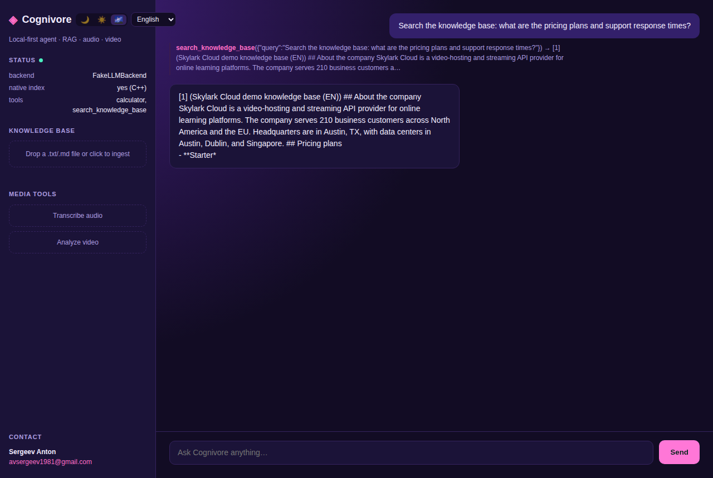
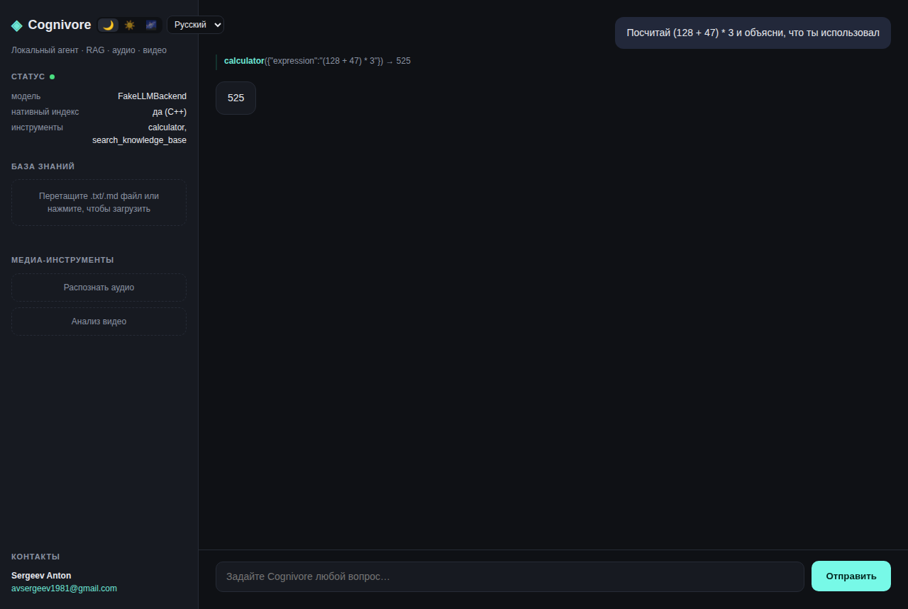

# Cognivore

**ローカルファーストで PyTorch 不要なマルチモーダル・エージェントフレームワーク。**
LLM による推論 + RAG を、自作の C++ ベクトルインデックスと Web チャット UI とともに
提供 —— すべてが CPU のみのノート PC 上で動作し、外部への通信は一切不要です。

[](https://github.com/Anton-Sergeev-EA/cognivore/actions/workflows/ci.yml)
[](https://github.com/Anton-Sergeev-EA/cognivore/actions/workflows/codeql.yml)
[](../../LICENSE)
[](../../pyproject.toml)
[](https://github.com/astral-sh/ruff)

🌐 **他の言語で読む：** [English](../../README.md) | [Русский](README.ru.md) | [Deutsch](README.de.md) | [Français](README.fr.md) | [Italiano](README.it.md) | [Español](README.es.md) | [中文](README.zh.md) | [日本語](README.ja.md) | [हिन्दी](README.hi.md)

Cognivore は、retrieval-augmented generation とマルチモーダルツール(音声の書き起こし、
動画のシーン解析)をサポートする ReAct 方式のエージェントフレームワークであり、スタック
全体にわたって PyTorch への依存を一切持たず、CPU のみのマシン上で完全に動作するように
設計されています。その検索インデックスは自作の C++ コア(AVX2 SIMD、OpenMP による並列な
厳密検索、そしてスクラッチから実装した近似 NSW グラフ)であり、pybind11 経由で Python に
公開されています。C++ コンパイラが存在しない場合でも `pip install` が失敗しないよう、
純粋な NumPy によるフォールバックも用意されています。

```
you> What does the ingested spec say about the retry policy, and what's 15% of that timeout in ms?

  [tool] search_knowledge_base({"query": "retry policy timeout"})
  [tool] calculator({"expression": "5000 * 0.15"})

cognivore> The spec (spec.md) sets a 5000ms timeout with exponential
backoff. 15% of that is 750ms.
```

同じループを Web UI 上で —— ツール呼び出しと取得された一節のライブトレースを、9 言語・3 テーマのいずれでも:

| Aurora テーマ、英語 —— RAG トレース | ダークテーマ、ロシア語 —— 計算機 |
|---|---|
|  |  |

## このプロジェクトが存在する理由

多くの「AI エージェント」ポートフォリオプロジェクトは、API 呼び出しを薄くラップしただけの
ものです。本プロジェクトはその逆を示すために作られています —— 興味深い部分(本物の ANN
データ構造、プロバイダに依存しないツール呼び出しプロトコル、ハイブリッドな検索パイプライン、
オプションの依存関係が無い場合の丁寧な劣化動作)を、外部ライブラリをインポートするのでは
なく自前で実装したフレームワークです。

## 機能

- **ReAct エージェントループ**(Thought → Action → Observation)—— 特定の
  function-calling ワイヤーフォーマットにファインチューニングされたモデルだけでなく、
  *任意の* 指示チューニング済みローカルモデルで動作します。詳細は
  [docs/architecture.md](../architecture.md#why-a-react-loop-instead-of-native-function-calling)
  を参照してください。
- **C++ によるネイティブベクトルインデックス**(`native/vector_index.cpp`):厳密な
  `FlatIndex`(AVX2/FMA によるドット積計算、OpenMP による並列スキャン)と、近似的な
  `NSWIndex`(スクラッチから実装した単層の Navigable Small World グラフ —— 挿入、
  近傍の枝刈り、貪欲なビームサーチ)の両方を、`.pyi` 型スタブ付きの自作 pybind11 拡張を
  通じて Python にバインドしています。インストール時に C++ コンパイラが存在しない場合は、
  自動的に純粋な NumPy 実装のインデックスにフォールバックします。
- **ハイブリッド RAG**:再帰的スプリッターによるチャンキング、`fastembed`(ONNX、
  PyTorch 不要)によるセマンティック埋め込み(ダウンロード不要のハッシュトリックによる
  フォールバック付き)、ベクトル検索 + BM25 のハイブリッド検索。
- **マルチモーダルツール**:安全な(AST ベースで `eval` を使わない)計算機、ナレッジ
  ベース検索、音声の書き起こしと簡易的な話者ターン分割(`faster-whisper`)、動画の
  シーン検出 + OCR(OpenCV)—— すべて CPU のみで動作し、PyTorch は不要です。
- **差し替え可能な LLM バックエンド**:`llama-cpp-python` によるローカル GGUF 推論、
  または決定論的で依存関係のない `FakeLLMBackend`(ダウンロード不要で、まったく同じ
  ツール呼び出しのコードパスを実行します)—— テストスイートと CI はこちらを対象に
  実行されます。
- **Web UI**:FastAPI + SSE ストリーミング + バニラ JS/HTML/CSS によるチャット
  インターフェース(ビルド手順もフレームワークも不要)。ファイル/音声/動画のドラッグ&
  ドロップ、リアルタイムの「思考中」/接続インジケーター、ダーク/ライト/aurora テーマ、
  そして英語、ロシア語、ドイツ語、フランス語、イタリア語、スペイン語、簡体字中国語、
  日本語、ヒンディー語への多言語対応を備えています。
- 充実したテストスイート、ruff による lint とフォーマット、mypy(ほぼ strict モード。
  ネイティブ拡張用のスタブを含む)、そしてマルチ OS・マルチ Python の CI マトリクス。

## クイックスタート

```bash
git clone https://github.com/Anton-Sergeev-EA/cognivore.git
cd cognivore
python3 -m venv .venv && source .venv/bin/activate
pip install -e .                 # C++17 コンパイラがあればネイティブ拡張をビルドします

cognivore chat                   # 対話型チャット、デフォルトではオフラインのデモモード
cognivore ingest ./docs          # markdown/テキストファイルのフォルダをインデックス化
cognivore serve                  # http://127.0.0.1:8420 で Web チャット UI を起動
```

デフォルトでは LLM のダウンロードも一切のネットワークアクセスも発生しません:エージェントは
`FakeLLMBackend` —— 小さな決定論的バックエンドですが、実際のツール呼び出しループを
そのまま実行します(何かを `ingest` した後に `What is 12 * 7?` や
`search the knowledge base for ...` を試してみてください)—— を相手に動作します。
実際のローカル LLM を使うには:

```bash
pip install -e ".[llm]"
# 例えば https://huggingface.co/Qwen/Qwen2.5-3B-Instruct-GGUF をダウンロード
cp .env.example .env
echo 'COGNIVORE_LLM_MODEL_PATH=/path/to/model.gguf' >> .env
cognivore chat
```

あるいは、もっと簡単に、C++ ツールチェーンを一切使わずに [Ollama](https://ollama.com)
を使う方法もあります —— `COGNIVORE_LLM_PROVIDER=auto`(デフォルト値)は、まずローカル
で動作している Ollama サーバーを試し、それが見つからなければ GGUF ファイルへのパスや
`FakeLLMBackend` にフォールバックします:

```bash
ollama pull qwen2.5:3b   # 指示チューニング済みのモデルであれば何でも動作します
cognivore chat           # 動作中の Ollama サーバーを自動的に検出します
```

音声/動画ツールにはそれぞれ独自の extras が必要です:`pip install -e ".[audio,video]"`
(GGUF を含めすべてが必要な場合は `.[all]`)。設定項目の一覧は `.env.example` を参照して
ください。

### Docker

このイメージはマルチステージビルドです(ネイティブ C++ 拡張をコンパイルした後、スリムな
ランタイムイメージのためにコンパイラを破棄します)。非 root ユーザーとして動作し、
`HEALTHCHECK` も備えています —— GitHub Actions の Docker レイヤーキャッシュを使って
一度ビルドされ、push のたびにエンドツーエンドで検証されます(サーバーが実際に
`/api/health` に応答すること、コンテナが `healthy` を報告すること、非 root で動作して
いること)。つまり単に「ビルドできる」だけでなく、「検証済み」です。

**最も簡単な方法 —— Python も Ollama のインストールも不要で、Windows・macOS・Linux で
同様に動作します:**

```bash
docker compose up -d --build
docker compose exec ollama ollama pull qwen2.5:3b   # 一度だけ実行、約2GB
```

その後 <http://127.0.0.1:8420> を開いてください。`docker-compose.yml` は Ollama も
*専用の*コンテナ内で実行するので、Docker 自体以外にホスト側でインストールするものは
何もありません。Cognivore は compose ネットワーク上でサービス名(`http://ollama:11434`)
を使って Ollama にアクセスするため、Windows/macOS/Linux 間でよくあるホストネットワーク
の違いを完全に回避できます。この一度限りの `ollama pull` を実行しなくても、Cognivore は
問題なく起動・動作します —— モデルが利用可能になるまで、単にオフラインの
`FakeLLMBackend` デモモードにフォールバックするだけです。

compose スタックは `COGNIVORE_SEED_DEMO_KB=true`
も設定しているため、新規のナレッジベースには、空
のドロップゾーンではなく、同梱の2つのデモ企業ハ
ンドブック(英語+ロシア語 —— 料金プラン、SLA、セ
キュリティ、返金ポリシー、サポートFAQ)が自動的に
投入されます。投入されるのは常に *空* のナレッジ
ベースのみです。自分のドキュメントを取り込んだ後
は、これは永続的に何もしない操作になります。空の
状態で起動したい場合は `docker-compose.yml` でこ
れを `false` に設定してください(または
`docker run -e COGNIVORE_SEED_DEMO_KB=false`)。
あるいは、いつでも `cognivore seed-demo` を実行
すれば、既存のストアに同じデモドキュメントを追加
できます。

**すでにホスト上で Ollama を動かしている、あるいは単一のコンテナだけにしたい場合は?**

```bash
docker build -t cognivore .
docker run -d -p 8420:8420 -v cognivore-data:/data \
  -e COGNIVORE_OLLAMA_HOST=http://host.docker.internal:11434 \
  --add-host=host.docker.internal:host-gateway \
  cognivore
```

`host.docker.internal` は Docker Desktop(Windows/macOS)では自動的に提供されます。
上記の明示的な `--add-host` は、それが無ければ解決できない通常の Linux 上でも同じ
コマンドを動作させるためのものです。

このイメージには音声/動画ツール(`faster-whisper`、OpenCV)が含まれていますが、
`llama-cpp-python` は*含まれていません* —— GGUF ファイルをプロセス内でロードする
代わりに、LLM とのやり取りには通常の HTTP で Ollama と通信します。これは意図的な設計で、
llama-cpp-python はすべてのプラットフォーム向けのビルド済みホイールを持っておらず、
ランタイムステージには存在しないコンパイラが必要になるためです。それでもコンテナ内で
プロセス内 GGUF 推論を行いたい場合は、最終ステージに `build-essential` を追加し、
`pip install` を `[all]` extra に切り替えてください。

**ビルド済みイメージ(ビルド手順が一切不要):** タグ付きリリースは、
[`.github/workflows/docker-publish.yml`](../../.github/workflows/docker-publish.yml)
によってマルチアーキテクチャ(amd64 + arm64 —— Apple Silicon と Raspberry Pi を含む)で
GHCR に公開されています:

```bash
docker pull ghcr.io/anton-sergeev-ea/cognivore:latest
```

## 使い方

**CLI**(全コマンドの一覧は `cognivore --help`):

```bash
cognivore chat                              # 対話型 REPL
cognivore ingest ./docs                     # .txt/.md/.markdown/.rst を再帰的にインデックス化
cognivore seed-demo                         # 同梱の英語+ロシア語デモ企業ハンドブックを追加
cognivore serve --host 0.0.0.0 --port 8420  # Web UI + REST/SSE API
cognivore bench                             # インデックスの構築/検索ベンチマーク(下記参照)
```

**Web UI**(`cognivore serve` を実行し、表示された URL を開く):リアルタイムのトークン
ストリーミングを備えたチャットインターフェース、`.txt`/`.md` の取り込みおよび音声/動画
ファイル用のドラッグ&ドロップゾーン、言語切り替え(9 言語)、3 種類のテーマ(ダーク/
ライト/aurora)、そしてある回答に対してエージェントが行ったすべてのツール呼び出しの
トレース表示(各ステップをクリックすると、省略されていない完全なツール出力を確認できます)
を提供します。

**REST/SSE API**(`cognivore serve` が起動している状態で):

```bash
curl http://127.0.0.1:8420/api/health

curl -X POST http://127.0.0.1:8420/api/chat \
  -H "Content-Type: application/json" \
  -d '{"message": "What is 12 * 7?"}'

curl -N "http://127.0.0.1:8420/api/chat/stream?message=Summarize+the+ingested+docs"

curl -X POST http://127.0.0.1:8420/api/ingest/file -F "file=@./notes.md"
```

**ライブラリとして**、CLI や API を経由せずに使う場合(`examples/` を参照):

```python
from cognivore.bootstrap import build_agent
from cognivore.config import get_settings

agent = build_agent(get_settings())
result = agent.run("What's 15% of 5000?")
print(result.answer)
```

## ベンチマーク

以下の数値は、2 コアの CI クラスのマシン上で `python benchmarks/bench_index.py` を実行
して得たものです(`Dockerfile` のイメージには可搬性がありますが、実際にお使いのノート PC
はほぼ確実により多くのコアを持っており、これは結果に影響します —— 詳細は後述)。ここで
使われているのはランダムかつ一様分布な 384 次元のベクトルであり、これは近似検索にとって
*最悪に近いケース*です(実際のクラスタ構造が無いため、「最も近い」近傍もランダムなものより
わずかにしか近くありません)。実際の埋め込みでは、同じ `ef` でも recall は明らかに向上
します。

**構築時間**(3,000 ベクトル)—— ここではネイティブ拡張の優位性は明白です:

| インデックス | 構築時間 | NumPy フォールバック比 |
|---|---|---|
| `FlatIndexPy`(NumPy、ループ内で `.add()`) | 0.615s | 1x |
| `FlatIndex`(C++) | 0.027s | **約 23 倍高速** |

**Recall と速度はトレードオフのつまみであり、単一の数字ではありません**(`NSWIndex`、
n=3,000):

| `ef` | ミリ秒/クエリ | Recall@10 |
|---|---|---|
| 50  | 0.24 | 0.64 |
| 150 (デフォルト) | 0.46 | 0.93 |
| 400 | 0.78 | 1.00 |

**検索レイテンシとコレクションサイズの関係** —— 厳密な線形スキャンは(AVX2+OpenMP で
加速されていても)、コレクションがスキャン自体がボトルネックになるほど大きくなるまでは
*十分に高速*です。近似グラフインデックスが優位に立ち始めるはずなのは、まさにその
交差点です:

| n | `FlatIndex` ミリ秒/クエリ | `NSWIndex` ミリ秒/クエリ(ef=150) | 高速化率 |
|---|---|---|---|
| 1,000 | 0.036 | 0.240 | 0.2x(ブルートフォースが優位 —— コレクションが小さすぎる) |
| 10,000 | 0.340 | 0.798 | 0.4x |
| 50,000 | 1.561 | 1.291 | 1.2x |

このテーブルは、都合の良い話のためではなく、実際にそこに書かれている内容として読んで
ください:このサイズにおいて、2 コアでは、SIMD + 並列ブルートフォーススキャンはスクラッチ
実装の近似インデックスと*同等か、それより高速*です。これは実際に発生する、よく知られた
ANN の挙動です —— 手作りの単層 NSW グラフは、キャッシュに優しい線形スキャンに比べて、
1 ステップあたりのオーバーヘッド(ヒープ操作、グラフ全体へのランダムなメモリアクセス、
訪問済み集合の管理)が明らかに大きくなります。また、多層 HNSW(Faiss/hnswlib の
アプローチであり、本プロジェクトではまだ実装されていません —— roadmap を参照)は、
まさにこの差を大規模なスケールで広げるために存在しています。誠実な結論としては:本
プロジェクトの ANN インデックスは*データ構造とアルゴリズム*そのものを正しく実証しています
(`tests/test_index.py` の recall 回帰テストを参照)が、それが実際に割に合うようになる
交差点はコア数、`ef`、そして実際の埋め込みがどれだけクラスタ化されているかによって変動
します —— これは「常に高速である」という普遍的な主張ではありませんし、この README も
そのように装うつもりはありません。

## テスト

```bash
pip install -e ".[dev]"
pytest --cov                 # 71件のテスト:計算機の安全性、チャンキング、
                              # ネイティブ版と Python 版インデックスの整合性、NSW の recall、
                              # エージェントループ、RAG ストア、FastAPI エンドポイント
ruff check . && ruff format --check .
mypy -p cognivore
```

上記のすべてのチェックは、CI(`.github/workflows/ci.yml`)が Ubuntu/macOS/Windows と
Python 3.10-3.12 の組み合わせで実行しているものと同じです。ネイティブ拡張のみに依存する
テストは、C++ ツールチェーンが利用できないマトリクスの構成では(失敗するのではなく)
自動的にスキップされます —— これはパッケージ自体が持つフォールバック動作と同じです。

## プロジェクト構成

[docs/architecture.md](../architecture.md)(英語)には、図と、二つの最も大きな設計判断
(プロバイダ固有の function calling ではなくテキストベースの ReAct ループを採用したこと、
および Faiss/hnswlib ではなく自作のインデックスを採用したこと)の背景となる理由が説明
されています。

```
native/            C++ vector index core + pybind11 bindings
src/cognivore/
  index/            native-vs-fallback index selection
  rag/              chunking, embeddings, hybrid document store
  agent/            ReAct loop, memory, prompt/parsing
  tools/            calculator, RAG search, audio, video
  llm/              llama.cpp backend + FakeLLMBackend
  media/            faster-whisper / OpenCV wrappers
  web/              FastAPI app + static chat UI
  cli.py            cognivore chat|ingest|serve|bench
benchmarks/         standalone scripts for the numbers above
examples/           minimal library-usage scripts
tests/              pytest suite (71 tests)
```

## ライセンス

MIT ライセンス —— 詳細は [LICENSE](../../LICENSE) を参照してください。

## お問い合わせ

**Sergeev Anton** によって開発されました([GitHub](https://github.com/Anton-Sergeev-EA)、[avsergeev1981@gmail.com](mailto:avsergeev1981@gmail.com))。
コントリビューション歓迎 —— 詳細は [CONTRIBUTING.md](../../CONTRIBUTING.md) を参照してください。
