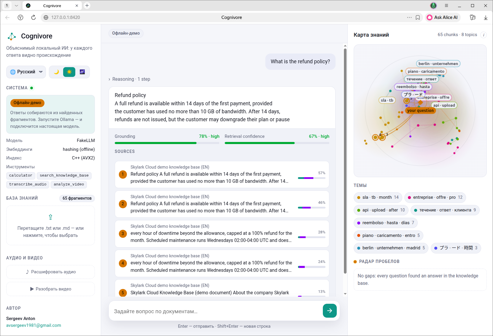
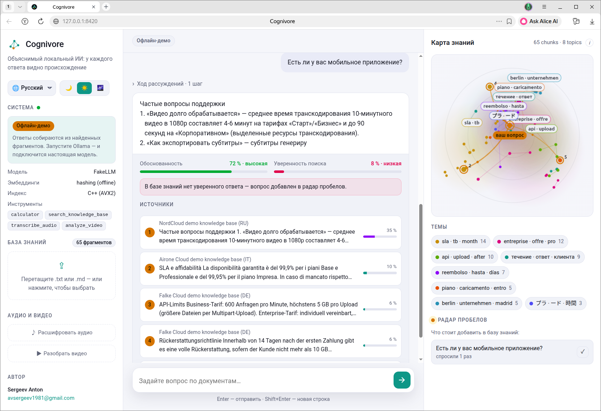
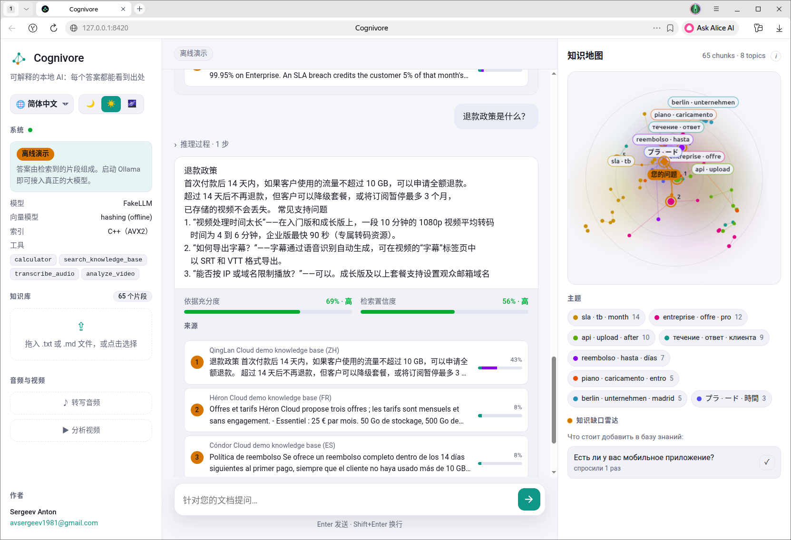

# Cognivore

**Объяснимый локальный ИИ для ваших документов.** Каждый ответ приходит с
доказательствами: живая **карта знаний** показывает, из каких фрагментов он
собран, **каждое предложение проверяется** по этим источникам, а вопросы,
на которые в документах нет ответа, попадают в **радар пробелов**. В основе —
мультимодальный агентный фреймворк без PyTorch: рассуждения LLM + RAG с
написанным на C++ векторным индексом. Всё работает на обычном CPU-ноутбуке,
ничего не уходит за пределы вашей машины.

Интерфейс на 9 языках: **русский, английский, китайский, испанский, хинди,
французский, немецкий, японский и итальянский**.

[](https://github.com/Anton-Sergeev-EA/cognivore/actions/workflows/ci.yml)
[](https://github.com/Anton-Sergeev-EA/cognivore/actions/workflows/codeql.yml)
[](../../LICENSE)
[](../../pyproject.toml)
[](https://github.com/astral-sh/ruff)

🌐 **Читать на другом языке:** [English](../../README.md) | [Русский](README.ru.md) | [Deutsch](README.de.md) | [Français](README.fr.md) | [Italiano](README.it.md) | [Español](README.es.md) | [中文](README.zh.md) | [日本語](README.ja.md) | [हिन्दी](README.hi.md)

Cognivore — это агентный фреймворк в стиле ReAct с retrieval-augmented
generation и поддержкой мультимодальных инструментов (распознавание речи,
анализ сцен в видео), спроектированный специально для работы целиком на
CPU, без единой зависимости от PyTorch во всём стеке. Его поисковый индекс —
написанное с нуля ядро на C++ (AVX2 SIMD, параллельный точный поиск через
OpenMP и приближённый граф NSW), доступное из Python через pybind11, с
резервным вариантом на чистом NumPy, чтобы `pip install` никогда не падал
из-за отсутствия компилятора C++.

```
you> What does the ingested spec say about the retry policy, and what's 15% of that timeout in ms?

  [tool] search_knowledge_base({"query": "retry policy timeout"})
  [tool] calculator({"expression": "5000 * 0.15"})

cognivore> The spec (spec.md) sets a 5000ms timeout with exponential
backoff. 15% of that is 750ms.
```

## Чем Cognivore отличается

Большинство RAG-чатов просят *поверить* ответу. Cognivore показывает, как
он к нему пришёл, — с помощью классического, проверяемого ML (только NumPy,
см. [`cognivore.ml`](../../src/cognivore/ml)), а не ещё одного вызова модели:

| | Что видно | Как устроено |
|---|---|---|
| **Карта знаний** | Каждый фрагмент базы знаний — звезда на карте, фрагменты сгруппированы в именованные темы. Заданный вопрос появляется на карте, от него тянутся лучи к фрагментам, которые на него ответили. | PCA эмбеддингов фрагментов в 2-D; темы — k-means++, число тем выбирается по силуэту; названия тем — class-based TF-IDF. Карта пересчитывается только при изменении базы. |
| **Проверка ответа** | Индикатор обоснованности под каждым ответом; предложения, которые источники не подтверждают, подчёркнуты волнистой линией, наведение на источник подсвечивает подтверждённые им предложения. | Каждое предложение сравнивается с каждым найденным фрагментом (60% совпадение ключевых слов + 40% близость эмбеддингов); оценка ответа — среднее, взвешенное по длине предложений. |
| **Рентген поиска** | У каждого источника видно, какая часть оценки пришла от *смысла*, а какая — от *совпадения слов*, и насколько уверенным был поиск в целом. | Векторная и BM25-составляющие гибридного поиска плюс мера покрытия вопроса, корректно работающая с китайским без словаря сегментации. |
| **Радар пробелов** | Вопросы, на которые в документах не нашлось ответа, объединённые по перефразировкам и отсортированные по частоте — готовый список того, что добавить в базу. | Уверенность поиска ниже порога; похожие вопросы объединяются по коэффициенту Жаккара; список сохраняется рядом с базой. |
| **Честное «не знаю»** | На вопрос, которого нет в документах, — прямой ответ «в базе знаний нет информации об этом» на языке вопроса: без догадок и выдуманных источников. | База знаний проверяется перед каждым ответом; ниже порога уверенности Cognivore отвечает сам, а не модель (`COGNIVORE_STRICT_KNOWLEDGE_ANSWERS`). |

Интерфейс полностью локализован на **русский (по умолчанию), английский,
упрощённый китайский, испанский, хинди, французский, немецкий, японский и
итальянский** — с формами множественного числа и форматом чисел; начальный
язык выбирается по языку браузера. Сам поиск многоязычный (токенизация с учётом иероглифов и
многоязычная модель эмбеддингов): китайский вопрос находит китайский
документ так же надёжно, как русский — русский.

| English · тёмная | Русский · светлая | 中文 · aurora |
|---|---|---|
|  |  |  |

Скриншоты сделаны в офлайн-демо без загрузки моделей (`FakeLLMBackend` и
встроенные демо-базы знаний) — ровно то, что покажет свежий
`docker compose up` до скачивания модели.

## Зачем этот проект существует

Большинство «AI-агентных» портфолио-проектов — это тонкая обёртка над
вызовом API. Этот проект показывает обратное: фреймворк, где интересные
части (настоящая структура данных ANN, провайдер-независимый протокол
вызова инструментов, гибридный конвейер поиска, аккуратная деградация при
отсутствии опциональных зависимостей) реализованы самостоятельно, а не
просто импортированы из готовой библиотеки.

## Возможности

- **Поиск перед каждым ответом** (auto-context): маленькие локальные
  модели часто пропускают поиск и гадают, поэтому база знаний проверяется
  заранее, а модели передаются только фрагменты, близкие к лучшему, с
  правилами: сохранять все цифры и условия, не смешивать темы. Язык ответа
  указывается явно, а ошибку формата вроде «Action: Final Answer» агент
  всё равно понимает как итоговый ответ.
- **Цикл агента ReAct** (Thought → Action → Observation), работающий с
  *любой* инструктивно обученной локальной моделью, а не только с
  моделями, файнтюненными под конкретный формат function calling — см.
  [docs/architecture.md](../architecture.md#why-a-react-loop-instead-of-native-function-calling).
- **Нативный векторный индекс на C++** (`native/vector_index.cpp`):
  точный `FlatIndex` (скалярное произведение AVX2/FMA, параллельный
  скан через OpenMP) и приближённый `NSWIndex` (написанный с нуля
  однослойный граф Navigable Small World — вставка, отсечение соседей,
  жадный поиск луча), оба привязаны к Python через написанное вручную
  расширение pybind11 со stub-файлом `.pyi`. Автоматически переключается
  на чистый NumPy-индекс, если во время установки нет компилятора C++.
- **Гибридный RAG**: чанкинг через рекурсивный сплиттер, семантические
  эмбеддинги `fastembed` (ONNX, без PyTorch) с резервным вариантом на
  hashing-trick без загрузок, гибридный поиск (вектор + BM25).
- **Мультимодальные инструменты**: безопасный (на основе AST, без
  `eval`) калькулятор, поиск по базе знаний, распознавание речи с грубым
  разделением по говорящим (`faster-whisper`) и анализ сцен видео
  (OpenCV) + распознавание текста на кадрах OCR (Tesseract) — всё на CPU,
  без PyTorch.
- **Подключаемый LLM-backend**: локальный инференс GGUF через
  `llama-cpp-python`, либо детерминированный `FakeLLMBackend` без единой
  зависимости, который проходит тот же самый код вызова инструментов без
  единой загрузки — именно на нём работают тесты и CI.
- **Слой объяснимости** (`cognivore.ml`, только NumPy): карта знаний
  (PCA + k-means++ + число тем по силуэту + названия c-TF-IDF), проверка
  обоснованности по предложениям, уверенность поиска и сохраняемый радар
  пробелов — всё это приходит в интерфейс SSE-событием `insight` после
  каждого ответа.
- **Многоязычный поиск**: токенизация с учётом иероглифов (биграммы
  символов, как в `CJKAnalyzer` из Lucene) для BM25 и офлайн-эмбеддера,
  многоязычная модель эмбеддингов по умолчанию, сниппеты вокруг
  релевантного места фрагмента и автоматический пересчёт векторов
  сохранённой базы при смене модели эмбеддингов.
- **Веб-интерфейс**: FastAPI + потоковая передача через SSE + интерфейс на
  чистом JS/HTML/CSS (без сборки, без фреймворка): анимированная карта
  знаний на canvas, индикаторы обоснованности и уверенности, карточки
  источников, радар пробелов, загрузка нескольких файлов перетаскиванием,
  темы тёмная/светлая/aurora, адаптивная вёрстка от телефона до широкого
  экрана и локализация на 9 языков: русский, английский, китайский,
  испанский, хинди, французский, немецкий, японский и итальянский.
- Полный набор тестов, линтер+форматирование ruff, mypy (в строгом режиме,
  включая stub для нативного расширения) и CI-матрица для нескольких
  ОС/версий Python.

## Быстрый старт

```bash
git clone https://github.com/Anton-Sergeev-EA/cognivore.git
cd cognivore
python3 -m venv .venv && source .venv/bin/activate
pip install -e .                 # собирает нативное расширение, если есть компилятор C++17

cognivore chat                   # интерактивный чат, по умолчанию офлайн-демо-режим
cognivore ingest ./docs          # индексирует папку с markdown/текстовыми файлами
cognivore serve                  # веб-чат на http://127.0.0.1:8420
```

По умолчанию никакая LLM не загружается и сети не требуется вообще: агент
работает на `FakeLLMBackend` — небольшом детерминированном backend'е,
который всё равно проходит реальный цикл вызова инструментов (попробуйте
`What is 12 * 7?` или `search the knowledge base for ...` после
`ingest`). Чтобы подключить настоящую локальную LLM:

```bash
pip install -e ".[llm]"
# скачайте, например, https://huggingface.co/Qwen/Qwen2.5-3B-Instruct-GGUF
cp .env.example .env
echo 'COGNIVORE_LLM_MODEL_PATH=/path/to/model.gguf' >> .env
cognivore chat
```

Либо проще, без компилятора C++ вообще — подключите
[Ollama](https://ollama.com): `COGNIVORE_LLM_PROVIDER=auto` (значение по
умолчанию) сначала пробует локально запущенный сервер Ollama, и только
потом падает обратно на путь к GGUF-файлу или `FakeLLMBackend`:

```bash
ollama pull qwen2.5:3b   # подходит любая инструктивно обученная модель
cognivore chat            # автоматически подхватит запущенный сервер Ollama
```

Если скачано несколько моделей, режим `auto` берёт первую из списка Ollama;
нужную закрепите через `COGNIVORE_OLLAMA_MODEL=qwen2.5:3b` (в `.env` или в
командной строке). «Думающие» модели, которые долго рассуждают перед
ответом (например, `openthinker`), плохо подходят к формату шагов агента.

Аудио/видео-инструменты требуют отдельных extras:
`pip install -e ".[audio,video]"` (или `.[all]` для всего сразу, включая
GGUF). Полный список настроек — в `.env.example`.

### Аудио и видео

Перетащите видео в веб-интерфейс (или отправьте в `POST /api/media/video`) —
Cognivore превратит его в хронологию и добавит в базу знаний. О нём можно
спрашивать, как о любом документе, а ответ укажет момент (`[00:14–00:21]`):

- **сцены** (слайды, экраны) находятся сравнением кадров — в том числе то,
  что пропускает сравнение яркости: смена слайда на том же фоне, плавные
  переходы, пункты, появляющиеся по одному, шаблонные слайды, которые
  отличаются одним числом;
- **текст на экране** каждой сцены читается Tesseract, для каждого кадра
  на нужном языке — все девять языков интерфейса, и видео может
  переключаться между ними;
- **речь** расшифровывается `faster-whisper` и ставится под слайд, который
  был на экране в этот момент.

Аудиофайлы (`POST /api/media/audio`) расшифровываются и добавляются так же.
Повторная загрузка того же файла не создаёт дублей; `?ingest=false` —
только разобрать, без добавления. Всё работает на CPU, без PyTorch.

Для текста на экране нужен сам бинарник
[Tesseract](https://github.com/tesseract-ocr/tesseract) и языковой пакет
для каждого языка (extra `video` ставит только Python-обёртку):

```bash
# Debian/Ubuntu
sudo apt install tesseract-ocr tesseract-ocr-rus tesseract-ocr-chi-sim tesseract-ocr-spa \
  tesseract-ocr-hin tesseract-ocr-fra tesseract-ocr-deu tesseract-ocr-jpn tesseract-ocr-ita
brew install tesseract tesseract-lang   # macOS
# Windows: https://github.com/UB-Mannheim/tesseract/wiki (отметьте языки в установщике)
```

`COGNIVORE_OCR_LANGUAGES=auto` (по умолчанию) использует все установленные
пакеты девяти языков. Если Tesseract или указанный пакет не установлен,
интерфейс так и скажет, а не вернёт молча пустой результат. Модель Whisper
(`small`, ~480 МБ) скачивается с Hugging Face при первой расшифровке речи.
В Docker-образе уже есть всё.

Cognivore читает видео, но не *видит* его: в ролике без текста и речи
искать нечего. Мелкий моноширинный текст в сильно сжатой записи экрана
читается плохо — записывайте терминал и код крупным шрифтом, это помогает
там, где обработка изображения бессильна.

### Docker

Образ собирается в несколько стадий (компилирует нативное расширение,
затем отбрасывает компилятор для компактного runtime-образа), запускается
не от root, и снабжён `HEALTHCHECK` — собирается один раз с кешированием
слоёв в GitHub Actions и проверяется целиком (сервер реально отвечает на
`/api/health`, контейнер сообщает `healthy`, работает не от root) при
каждом push — то есть не просто «собралось», а «проверено».

**Самый простой способ — без Python, без установки Ollama, одинаково
работает на Windows, macOS и Linux:**

```bash
docker compose up -d --build
docker compose exec ollama ollama pull qwen2.5:3b   # разово, ~2 ГБ
```

Затем откройте <http://127.0.0.1:8420>. `docker-compose.yml` запускает
Ollama *тоже* в отдельном контейнере, так что на хосте не нужно ничего
устанавливать кроме самого Docker; Cognivore обращается к нему внутри
docker-сети по имени сервиса (`http://ollama:11434`), что полностью
избегает разницы в сетевых настройках между Windows/macOS/Linux. Без
разового `ollama pull` Cognivore всё равно запустится и заработает — просто
откатится в офлайн-демо-режим `FakeLLMBackend`, пока модель не появится.

Кроме того, стек compose устанавливает `COGNIVORE_SEED_DEMO_KB=true`, поэтому
свежая база знаний автоматически заполняется девятью демонстрационными базами
знаний компаний, по одной на каждый язык интерфейса (тарифы, SLA, безопасность, политика
возврата, частые вопросы) вместо пустой зоны загрузки. Заполняется только
*пустая* база знаний: как только вы загрузите свои документы, это навсегда
становится no-op. Установите `false` в `docker-compose.yml` (или `docker run
-e COGNIVORE_SEED_DEMO_KB=false`), чтобы начать с пустой базы, либо запустите
`cognivore seed-demo` в любой момент, чтобы добавить те же демо-документы в
уже существующее хранилище.

**Уже есть Ollama на хосте, или нужен один контейнер?**

```bash
docker build -t cognivore .
docker run -d -p 8420:8420 -v cognivore-data:/data \
  -e COGNIVORE_OLLAMA_HOST=http://host.docker.internal:11434 \
  --add-host=host.docker.internal:host-gateway \
  cognivore
```

`host.docker.internal` предоставляется автоматически в Docker Desktop
(Windows/macOS); явный `--add-host` выше — то, что заставляет ту же самую
команду работать и на обычном Linux, где иначе это имя не резолвится.

Образ включает аудио/видео-инструменты (`faster-whisper`, OpenCV, и
Tesseract для распознавания текста на кадрах), но *не* `llama-cpp-python` — он общается с Ollama по обычному HTTP вместо
загрузки GGUF-файла прямо в процессе, намеренно, поскольку у
llama-cpp-python нет готового пакета под каждую платформу, а компилятора
в runtime-стадии нет. Всё равно хотите инференс GGUF прямо в контейнере?
Добавьте `build-essential` в финальную стадию и переключите её
`pip install` обратно на extra `[all]`.

`faster-whisper` скачивает свою модель распознавания речи с Hugging Face
при первом реальном использовании транскрипции (не во время сборки) —
похоже на `ollama pull` для LLM, только это происходит автоматически, без
отдельной команды. Как и модели Ollama, она кешируется в персистентном
volume `cognivore-data` (`HF_HOME=/data/hf-cache`), так что скачивается
только один раз, а не при каждом `docker compose up --build`.

**Остановка и повторный запуск** (например, после перезагрузки):

```bash
docker compose down   # останавливает оба контейнера; данные сохраняются (см. ниже)
docker compose up -d  # запускает снова -- --build не нужен, если сам образ не менялся
```

Оба сервиса настроены с `restart: unless-stopped`, так что если вы не
остановили их вручную перед выключением, Docker перезапустит их сам, как
только демон Docker снова поднимется (по умолчанию так и происходит в
большинстве установок) — в этом случае никакая команда не нужна вовсе.
База знаний и закешированные модели Whisper/Ollama живут в именованных
volume'ах `cognivore-data` и `ollama-data`, которые `docker compose down`
никогда не трогает; удаляет их только явный `docker compose down -v`.

**Готовый образ (без единого шага сборки):** релизы с тегами публикуются
мультиархитектурно (amd64 + arm64 — включая Apple Silicon и Raspberry Pi)
в GHCR через [`.github/workflows/docker-publish.yml`](../../.github/workflows/docker-publish.yml):

```bash
docker pull ghcr.io/anton-sergeev-ea/cognivore:latest
docker run --rm -p 8420:8420 -v cognivore-data:/data ghcr.io/anton-sergeev-ea/cognivore:latest
# → http://127.0.0.1:8420
```

## Использование

**CLI** (`cognivore --help` — полный список команд):

```bash
cognivore chat                              # интерактивный REPL
cognivore ingest ./docs                     # рекурсивно индексирует .txt/.md/.markdown/.rst
cognivore seed-demo                         # добавляет демо-базы знаний (по одной на каждый язык интерфейса)
cognivore serve --host 0.0.0.0 --port 8420  # веб-интерфейс + REST/SSE API
cognivore bench                             # бенчмарки построения/поиска индекса (см. ниже)
```

**Веб-интерфейс** (`cognivore serve`, затем откройте выведенный адрес):
чат с живой потоковой передачей токенов, зона drag-and-drop для загрузки
`.txt`/`.md`, а также аудио/видео-файлов, переключатель языка (9 языков), три темы (тёмная/светлая/aurora), трассировка
каждого вызова инструмента, который агент сделал для ответа, и панель
объяснимости из раздела [Чем Cognivore отличается](#чем-cognivore-отличается):
клик по звезде на карте или по карточке источника открывает фрагмент целиком.

**REST/SSE API**, после запуска `cognivore serve`:

```bash
curl http://127.0.0.1:8420/api/health

curl -X POST http://127.0.0.1:8420/api/chat \
  -H "Content-Type: application/json" \
  -d '{"message": "What is 12 * 7?"}'

curl -N "http://127.0.0.1:8420/api/chat/stream?message=Summarize+the+ingested+docs"

curl -X POST http://127.0.0.1:8420/api/ingest/file -F "file=@./notes.md"
```

**Как библиотека**, а не через CLI или API (см. `examples/`):

```python
from cognivore.bootstrap import build_agent
from cognivore.config import get_settings

agent = build_agent(get_settings())
result = agent.run("What's 15% of 5000?")
print(result.answer)
```

## Бенчмарки

Цифры из `python benchmarks/bench_index.py` на 2-ядерной машине
CI-класса (образ `Dockerfile` переносим; на вашем реальном ноутбуке почти
наверняка больше ядер, и это важно — см. ниже). Случайные,
равномерно распределённые 384-мерные векторы — это близко к *худшему
случаю* для приближённого поиска (нет реальной кластерной структуры,
поэтому «ближайшие» соседи лишь незначительно ближе случайных); на
реальных эмбеддингах recall заметно выше при том же `ef`.

**Время построения** (3 000 векторов) — здесь преимущество нативного
расширения однозначно:

| Индекс | Время построения | vs. NumPy-резерв |
|---|---|---|
| `FlatIndexPy` (NumPy, `.add()` в цикле) | 0.615с | 1x |
| `FlatIndex` (C++) | 0.027с | **~в 23 раза быстрее** |

**Recall и скорость — это настраиваемый параметр, а не одно число**
(`NSWIndex`, n=3 000):

| `ef` | мс/запрос | Recall@10 |
|---|---|---|
| 50  | 0.24 | 0.64 |
| 150 (по умолчанию) | 0.46 | 0.93 |
| 400 | 0.78 | 1.00 |

**Задержка поиска в зависимости от размера коллекции** — точный линейный
скан (даже с ускорением AVX2+OpenMP) *нормален*, пока коллекция не
становится настолько большой, что сам скан становится узким местом; именно
в этой точке приближённый граф должен начинать выигрывать:

| n | `FlatIndex` мс/запрос | `NSWIndex` мс/запрос (ef=150) | Прирост |
|---|---|---|---|
| 1 000 | 0.036 | 0.240 | 0.2x (брутфорс выигрывает — коллекция слишком мала) |
| 10 000 | 0.340 | 0.798 | 0.4x |
| 50 000 | 1.561 | 1.291 | 1.2x |

Читайте эту таблицу как есть, а не так, как хотелось бы для красивой
истории: на этих размерах, на 2 ядрах, SIMD+параллельный брутфорс-скан
*конкурентен или быстрее* приближённого индекса, написанного с нуля. Это
реальное, хорошо документированное поведение ANN-индексов — у
однослойного NSW-графа, написанного вручную, заметно больше накладных
расходов на шаг (операции с кучей, произвольный доступ к памяти по графу,
учёт посещённых узлов), чем у дружелюбного к кешу линейного скана, а
многослойный HNSW (подход Faiss/hnswlib, здесь пока не реализован — см.
roadmap) существует специально, чтобы увеличить этот разрыв на больших
масштабах. Честный вывод: ANN-индекс этого проекта корректно демонстрирует
*структуру данных и алгоритм* (см. регрессионный тест recall в
`tests/test_index.py`), а точка, где он начинает окупаться, зависит от
количества ядер, `ef` и того, насколько кластеризованы ваши реальные
эмбеддинги — это не универсальное утверждение «всегда быстрее», и этот
README не будет притворяться, что это так.

## Тестирование

```bash
pip install -e ".[dev]"
pytest --cov                 # 192 теста: безопасность калькулятора, чанкинг,
                              # паритет нативного и Python-индекса, recall NSW,
                              # цикл агента, RAG-хранилище, эндпоинты FastAPI,
                              # PCA/k-means/силуэт, обоснованность, пробелы,
                              # токенизация иероглифов, сниппеты, auto-context,
                              # все 9 языков интерфейса от начала до конца
ruff check . && ruff format --check .
mypy -p cognivore
```

Тесты изолированы: они запускаются из пустой папки, без переменных
`COGNIVORE_*`, с офлайн-моделью и офлайн-эмбеддингами, поэтому ни ваш `.env`,
ни запущенная Ollama на результат не влияют (`tests/conftest.py`).

Всё вышеперечисленное — это именно то, что запускает CI
(`.github/workflows/ci.yml`), на Ubuntu/macOS/Windows и Python 3.10-3.12;
тесты, зависящие только от нативного расширения, самостоятельно
пропускаются (а не падают) на той конфигурации матрицы, где недоступен
C++-тулчейн — так же, как ведёт себя сам пакет.

## Структура проекта

См. [docs/architecture.md](../architecture.md) (на английском) для схемы
и обоснования двух главных архитектурных решений (текстовый цикл ReAct
вместо function calling конкретного провайдера, и написанный вручную
индекс вместо Faiss/hnswlib).

```
native/            ядро векторного индекса на C++ + привязки pybind11
src/cognivore/
  index/            выбор нативного индекса или резервного варианта
  rag/              чанкинг, токенизация, эмбеддинги, сниппеты, гибридное хранилище
  ml/               карта знаний, обоснованность, уверенность поиска, радар пробелов
  agent/            цикл ReAct, память, промпты/парсинг
  tools/            калькулятор, поиск RAG, аудио, видео
  llm/              backend llama.cpp + FakeLLMBackend
  media/            обёртки над faster-whisper / OpenCV
  web/              приложение FastAPI + статический интерфейс (чат, карта знаний, i18n)
  cli.py            cognivore chat|ingest|serve|bench
benchmarks/         отдельные скрипты для цифр выше
examples/           минимальные скрипты использования библиотеки
tests/              набор тестов pytest (192 теста)
```

## Лицензия

MIT — см. [LICENSE](../../LICENSE).

## Контакты

Разработчик — **Sergeev Anton** ([GitHub](https://github.com/Anton-Sergeev-EA), [avsergeev1981@gmail.com](mailto:avsergeev1981@gmail.com)).
Контрибуции приветствуются — см. [CONTRIBUTING.md](../../CONTRIBUTING.md).
